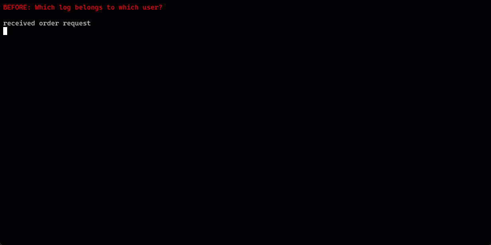

# Contextual Logger for Node.js

By [PurpleOwl](https://purpleowl.io)

A **drop-in `console.log` replacement** that automatically attaches **user IDs, transaction IDs, and async context** to every log statement — across `async/await`, promises, background jobs, and Express requests — with two lines of setup.

Built for real production systems, not tutorials.


---

## What Problem This Solves

Most Node.js applications start with simple logging:

```javascript
console.log('contact created');
```

That works until you have:

- multiple concurrent users
- overlapping async requests
- background jobs that outlive HTTP responses
- production issues you need to debug after the fact

At that point, logs stop telling a story. This logger fixes that **without refactoring your existing logging code**.

---

## What This Logger Does

Every log line automatically includes:

- ISO timestamp
- log level (`debug`, `info`, `warn`, `error`)
- `userId` (if available)
- `transactionId` (shared across the request)
- optional business context (orderId, invoiceId, jobId, etc.)

**Before:**
```
contact created
```

**After:**
```json
{"ts":"2025-01-15T10:23:01.000Z","level":"info","userId":"alex_123","txId":"abc-789","msg":"contact created"}
```

Same `console.log`. Production-grade context.

---

## Why This Is Different

Most logging libraries require you to:

- replace every `console.log`
- pass context manually
- adopt a new API everywhere
- refactor existing code

This logger:

- works with existing `console.log()` calls
- automatically propagates context across async boundaries
- uses Node's `AsyncLocalStorage`
- requires **no logging refactor**

---

## Installation

```bash
npm i @purpleowl-io/tracepack
```

---

## Setup (2 Steps)

### Step 1: Initialize at app entry point

```javascript
// app.js — at the very top, before other imports
import { replaceConsole, loggerMiddleware } from '@purpleowl-io/tracepack';

replaceConsole();  // defaults: level 'info', output to console

// Or with options:
replaceConsole({
  level: 'debug',
  output: 'both',
  filePath: './logs/app.log'
});
```

This globally replaces `console.log`, `console.info`, `console.debug`, `console.warn`, and `console.error`.

### Step 2: Add Express middleware

After authentication, before routes:

```javascript
import express from 'express';
const app = express();

app.use(authMiddleware);
app.use(loggerMiddleware());
app.use('/api', routes);
```

That's it.

More examples: [README-EXAMPLES.md](README-EXAMPLES.md)

---

## How It Works

1. Request arrives
2. Middleware captures `userId` from `req.user.id` and generates a `txId`
3. This context follows all async operations automatically
4. Every `console.log` includes the context

```javascript
function updateContact(data) {
  console.log('updating contact', data.id);
  // Output: {"userId":"alex_123","txId":"abc-789","msg":"updating contact","args":[12345]}
}
```

You can now:
- `grep "alex_123"` — see everything one user did
- `grep "abc-789"` — see a complete request flow

---

## Console Methods Supported

| Method | Mapped To |
|--------|-----------|
| `console.log()` | info level |
| `console.info()` | info level |
| `console.debug()` | debug level |
| `console.warn()` | warn level |
| `console.error()` | error level |

---

## Configuration

Pass options to `replaceConsole()`:

```javascript
replaceConsole({
  level: 'info',              // 'debug' | 'info' | 'warn' | 'error' | 'none'
  output: 'console',          // 'console' | 'file' | 'both'
  filePath: './logs/app.log'  // required when output is 'file' or 'both'
});
```

### Log Levels

| Level | Output |
|-------|--------|
| `debug` | Everything |
| `info` | info + warn + error (default) |
| `warn` | warn + error only |
| `error` | errors only |
| `none` | silent |

### Output Destinations

| Value | Behavior |
|-------|----------|
| `console` | stdout/stderr only (default) |
| `file` | Write to file only |
| `both` | Console and file |

The log directory is created automatically if it doesn't exist.

---

## Middleware Options

```javascript
// Default: looks for req.user.id
app.use(loggerMiddleware());

// Custom userId path (if your auth sets it differently)
app.use(loggerMiddleware({ userIdPath: 'auth.userId' }));

// Custom transaction ID header (for distributed tracing)
app.use(loggerMiddleware({ txIdHeader: 'x-request-id' }));

// Combine options
app.use(loggerMiddleware({ 
  userIdPath: 'auth.sub',
  txIdHeader: 'x-request-id'
}));
```

### Common Auth Provider Mappings

| Provider / Library | userIdPath | Notes |
|--------------------|------------|-------|
| **Passport.js** | `user.id` (default) | Standard Passport serialization |
| **Auth0** | `auth.sub` | OIDC subject claim |
| **Firebase Admin** | `user.uid` | Firebase Auth decoded token |
| **AWS Cognito** | `user.sub` | Cognito JWT sub claim |
| **Google IAP** | `user.id` | Identity-Aware Proxy |
| **Azure AD / Entra** | `user.oid` | Object ID from JWT |
| **Clerk** | `auth.userId` | Clerk middleware |
| **Supabase** | `user.id` | Supabase Auth |
| **Keycloak** | `user.sub` | Keycloak JWT |
| **NextAuth / Auth.js** | `user.id` | Session user |
| **express-jwt** | `auth.sub` | Decoded JWT payload |
| **Custom JWT** | `user.sub` or `auth.sub` | Depends on your setup |


### Common Transaction ID Headers

| System | txIdHeader | Notes |
|--------|------------|-------|
| **Default** | `x-transaction-id` | This logger's default |
| **AWS ALB/ELB** | `x-amzn-trace-id` | AWS load balancer trace |
| **Cloudflare** | `cf-ray` | Cloudflare Ray ID |
| **GCP Cloud Run** | `x-cloud-trace-context` | GCP trace header |
| **Azure** | `x-ms-request-id` | Azure request ID |
| **OpenTelemetry** | `traceparent` | W3C Trace Context |
| **Nginx** | `x-request-id` | Common Nginx config |
| **Kong / API Gateways** | `x-request-id` | API gateway standard |
| **Datadog** | `x-datadog-trace-id` | Datadog APM |


---

## Adding Business Context

When you need richer context mid-request:

```javascript
import { log } from '@purpleowl-io/tracepack';

app.post('/orders', async (req, res) => {
  log.addContext({ orderId: req.body.id });
  
  // All console.log calls from here include orderId
  await processOrder();  // logs have orderId
  await chargePayment(); // logs have orderId
  
  res.json({ ok: true });
});
```

This is especially useful for order processing, billing workflows, and long-running jobs.

---

## Background Jobs & Scripts

For cron jobs, workers, or scripts outside HTTP requests:

```javascript
import { withContext } from '@purpleowl-io/tracepack';

async function nightlyJob() {
  await withContext({ userId: 'system', txId: 'nightly-' + Date.now() }, async () => {
    console.log('starting batch');  // Has context
    await processBatch();
    console.log('batch complete');  // Has context
  });
}
```

---

## Fire-and-Forget Operations

If work continues after the request ends:

```javascript
import { captureContext, runWithCapturedContext } from '@purpleowl-io/tracepack';

app.post('/orders', (req, res) => {
  const ctx = captureContext();  // Grab context before request ends
  
  setTimeout(() => {
    runWithCapturedContext(ctx, () => {
      console.log('sending follow-up email');  // Still has original context
    });
  }, 60000);
  
  res.json({ ok: true });
});
```

---

## Output Format & Tooling

Logs are **newline-delimited JSON**, compatible with:

- `jq`
- ELK / OpenSearch
- Datadog
- GCP / AWS logging
- plain file logs

Example filtering:

```bash
# Pretty print
node app.js | jq .

# Filter by user
node app.js | jq 'select(.userId == "alex_123")'

# Filter by transaction
node app.js | jq 'select(.txId == "abc-789")'

# Errors only
node app.js | jq 'select(.level == "error")'
```

---

## Troubleshooting

**Context is null:** Log happened outside a request or before middleware ran. For background jobs, use `withContext()`.

**Not seeing debug logs:** Set log level to `debug` in config.

**userId is null:** Middleware runs before auth. Move `loggerMiddleware()` after your auth middleware, or adjust `userIdPath` option.

---

## When You Should Use This

This logger is ideal if you:

- run a Node.js or Express backend
- have async workflows
- support multiple users
- need to debug production issues
- don't want a logging refactor

---

## Design Philosophy

- Zero refactor
- Async-safe by default
- No vendor lock-in
- No logging platform dependency
- Built for long-lived systems

---

## License

MIT - [PurpleOwl](https://purpleowl.io)
